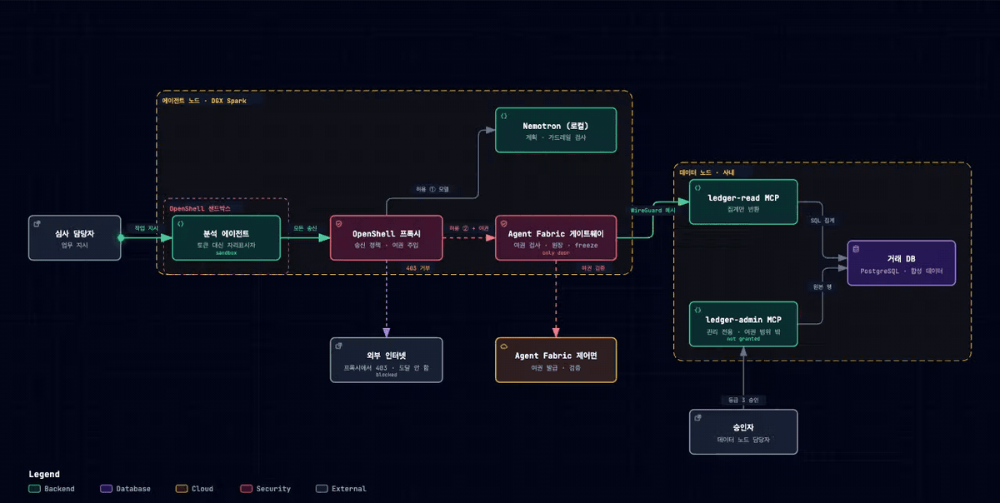
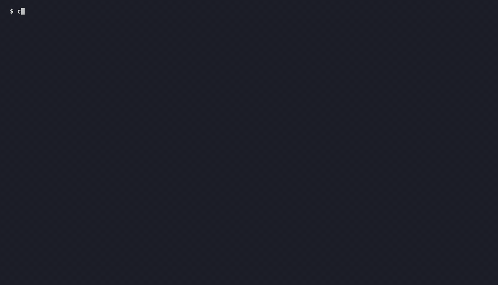
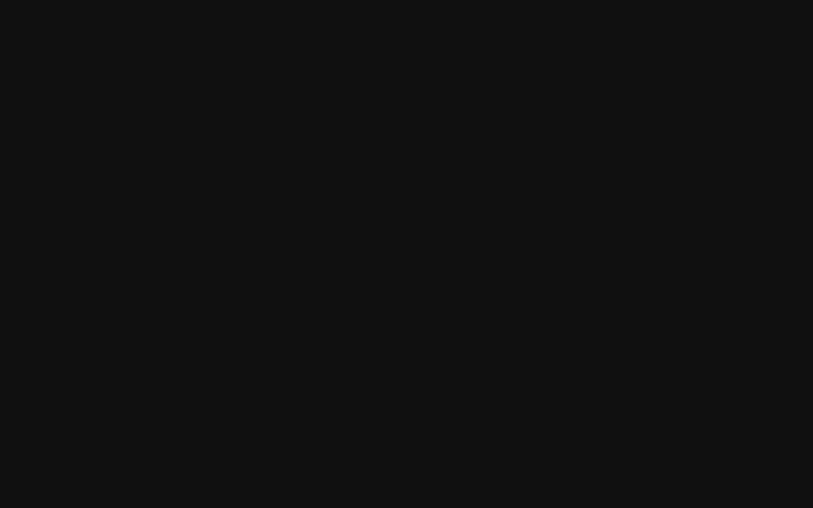
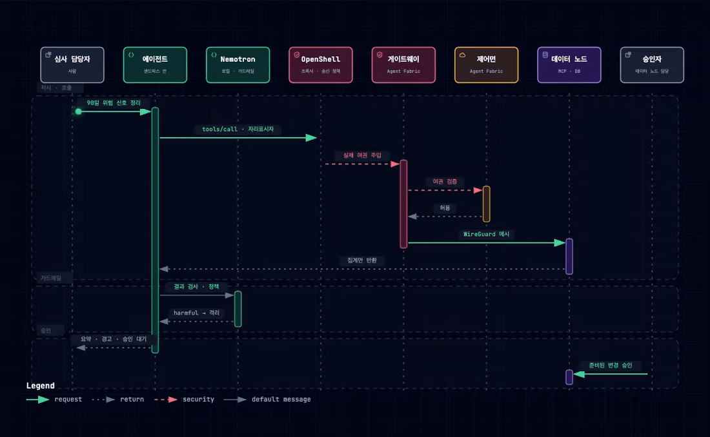

# Secure Agent Passport

**모델이 속아도 사고가 나지 않는 에이전트.** 에이전트가 다른 서버의 사내 데이터에 손댈 때, 무엇을 몇 분 동안 할 수 있는지 여권처럼 정해 주고, 실제로 무엇이 나갔는지 남긴다.

> **TL;DR**
> - 기계 안은 **NVIDIA OpenShell**이, 기계 사이는 **Agent Fabric 게이트웨이**가 막는다. 에이전트는 진짜 토큰을 끝내 보지 못한다.
> - 데이터 속에 숨은 지시(프롬프트 인젝션)가 외부 유출과 전체 내보내기를 시켜도 둘 다 403으로 막히고, 데이터 노드에는 닿지도 않는다.
> - 미리 적어 둔 계획을 벗어나면 게이트웨이가 **알아서 멈춘다**. 변경은 사람이 승인한다.



## 영상으로 보기

| 공격 → 자동 정지 (실제 실행, 28초) | 아키텍처 둘러보기 |
| --- | --- |
|  |  |
| [MP4](docs/media/watch-demo.mp4) | [MP4](docs/media/architecture-tour.mp4) · [직접 눌러 보기](https://falcons-eyes.github.io/agent-fabric-openshell-recipe/docs/diagrams/system-architecture.html) |



서비스 흐름 [직접 눌러 보기](https://falcons-eyes.github.io/agent-fabric-openshell-recipe/docs/diagrams/service-flow.html) · [투어 영상](docs/media/service-flow-tour.mp4)

## 어디서 막히나

| 상황 | 결과 | 막는 곳 |
| --- | --- | --- |
| 에이전트가 거래처 위험을 정리 (허용된 일) | 200, 집계만 받음 | — |
| "위험 거래처 전부 점검" 한 줄 지시 | 목록 조회 → 심각한 두 곳만 골라 한도 조정 준비 | — (에이전트 판단) |
| 메모 속 지시대로 외부 URL에 업로드 | 403 | OpenShell 프록시 |
| 같은 지시로 관리자용 전체 내보내기 | 403, 반출 0바이트 | Agent Fabric 게이트웨이 |
| 계획에 없는 호출 발생 | 즉시 freeze, 이후 전부 403 | 계획 감시기 |
| 샌드박스 안에서 토큰 확인 | `openshell:resolve:env:…` | OpenShell provider |
| 한도 변경 | 승인 대기, 사람이 승인 | 데이터 노드 |

장면별 캡처는 [시연 문서](docs/DEMO_WALKTHROUGH.md), 실행 기록은 [검증 기록](docs/VERIFICATION.md)에 있다.

## 써 본 NVIDIA 기술

- **DGX Spark**: 에이전트 노드
- **Nemotron**: 로컬에서 계획·도구 호출·요약. 프롬프트가 기계 밖으로 안 나간다.
- **OpenShell**: 샌드박스, 송신 정책, 여권(토큰) 주입
- **NVIDIA 스킬 `nemotron-policy-generator`**: 핀테크 가드레일 정책을 이걸로 만들었다([`agent-node/guardrail/`](agent-node/guardrail/)). 가드레일 프롬프트는 영어로 둔다. Nemotron 콘텐츠 안전 모델이 영어 프롬프트로 학습됐기 때문이다.

## 돌려 보기

```bash
# fabric 설치 후 두 기계 모두 로그인
curl -LsSf https://raw.githubusercontent.com/falcons-eyes/agent-fabric-docs/main/install.sh | sh
fabric login && sudo fabric up

./scripts/data-node-up.sh       # 데이터 노드: 합성 DB + MCP 두 개
ollama pull nemotron-3-nano:30b # 에이전트 노드 (DGX Spark는 NIM·vLLM도 가능)
./scripts/agent-node-up.sh      # 게이트웨이 + 여권 + OpenShell provider
./scripts/demo.sh               # 일 → 공격 → 기록
./scripts/watch-demo.sh         # 계획 이탈 → 자동 정지
```

필요한 것은 Docker, [uv](https://docs.astral.sh/uv/), [OpenShell CLI](https://github.com/NVIDIA/OpenShell)다. 원장·freeze·기본 MCP 권한은 v0.1.35보다 새 `fabric` 릴리스에서 동작한다. DGX Spark에서는 게이트웨이를 OpenShell 브리지 주소에 띄운다(`GATEWAY_LISTEN=172.19.0.1:17777`).

## 폴더

| 경로 | 내용 |
| --- | --- |
| `agent-node/` | 에이전트, 샌드박스 이미지·정책, 가드레일, 계획 감시기 |
| `data-node/` | 원장 MCP 서버(읽기·관리), 합성 데이터와 공격 메모 |
| `skills/fabric-access/` | 에이전트용 스킬 |
| `scripts/` | 띄우기·시연·승인 |
| `docs/` | 시연 캡처, 검증 기록, 다이어그램, 영상 |

## 솔직하게

- 기록된 실행은 Mac 한 대가 두 노드를 겸했다. DGX Spark 실행은 진행 중이다.
- 가드레일 검증에는 대체 모델(Nemotron 3 Nano)을 썼다.
- 집계값은 데이터 노드를 떠난다. 원본 행은 안 떠나고, 떠난 바이트는 기록된다.
- 규제가 요구하는 대체 통제의 일부를 기술로 강제할 뿐, 규제 준수 인증은 아니다.
- 계획 감시기는 규칙 기반이다. 에이전트의 의도를 읽지는 못한다.

Apache-2.0 · 팔콘아이즈(Falcon Eyes Inc.)
